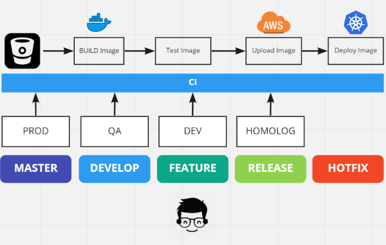

# GitFlow ?

São diretrizes para organização de branches, criado por Vincent Driessen.  :smiley:


#### Algumas diretrizes:

* Ambiente de Produção (Production Ready)

  Branch **origin/master** com todo o código testado que foi entregue ao ambiente de produção.

  Branch **origin/develop** com todas as features que estão aptas para gerar um novo release.

* Features (Dev Stage)

  Branch **feature/{cod_name_feature}** é criada para separar os commits de uma funcionalidade nova.

  As branches  só irâo existir enquanto estiverem em desenvolvimento.

  Ao finalizar a features todos commits são adicionados (merge) na branch **develop**

* Release (QA Stage)

  Branch **release/{cod_name_release}** é usada para preparar o lançamento da próxima versão da aplicação.

  Pequenas correções são permitidas neste ambiente. Novas funcionalidades ou Reworks são proibidos.

  Quando o release é finalizado os commits são adicionados (merge) nas branches de **develop** e **master**.

* Hotfixes (Bug Stage)

  As branches **hotfix/{cod_fix}** são utilizadas para corrigir bugs que estão acontecendo no ambiente de produção. 

  Quando o hotfix é finalizado os commits são adicionados (merge) em **master**, **develop** e **release**.


## GIT - Boas práticas

### Comentários

1. Os títulos dos commits devem ter no máximo 50 characteres

```
fix: replace wrong text in user guide
```

### Smart Commits

-> features/JIRA_CODE


### Pull Request


## WorkFlow Completo

